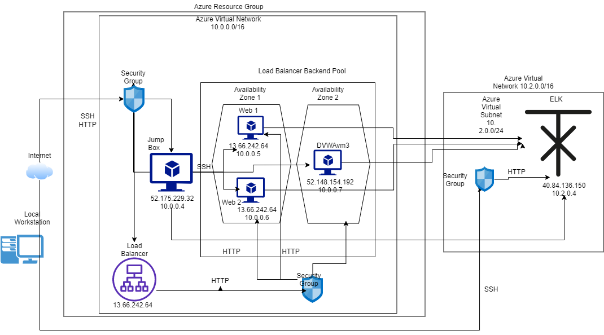
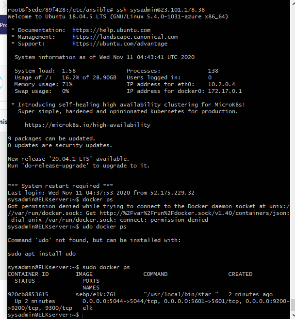

## Automated ELK Stack Deployment

The files in this repository were used to configure the network depicted below.

These files have been tested and used to generate a live ELK deployment on Azure. They can be used to either recreate the entire deployment pictured above. Alternatively, select portions of the __ansible yaml playbook___ file may be used to install only certain pieces of it, such as Filebeat.

This document contains the following details:
- Description of the Topology
- Access Policies
- ELK Configuration
  - Beats in Use
  - Machines Being Monitored
- How to Use the Ansible Build

### Description of the Topology

The main purpose of this network is to expose a load-balanced and monitored instance of DVWA, the D*mn Vulnerable Web Application.

Load balancing ensures that the application will be highly available in addition to restricting access to the network.
-  What aspect of security do load balancers protect? What is the advantage of a jump box? Loan balancer protects the inbound traffic and regulate network traffic. Jump box is used to connect the different VMs but does not provide high availabilty.

Integrating an ELK server allows users to easily monitor the vulnerable VMs for changes to the network and system configuration.
-  What does Filebeat watch for? Log files
- What does Metricbeat record?_Numbers of the systems performers

The configuration details of each machine may be found below.
_Note: Use the [Markdown Table Generator](http://www.tablesgenerator.com/markdown_tables) to add/remove values from the table_.

| Name     | Function | IP Address | Operating System |
|----------|----------|------------|------------------|
| Jump Box | Gateway  | 10.0.0.1   | Linux            |
| Web 1    | Webserver| 10.0.0.5   | Linux            |
| Web 2    | Webserver| 10.0.0.6   | Linux            |
| DVWA3    | Webserver| 10.0.0.7   | Linux            |

### Access Policies

The machines on the internal network are not exposed to the public Internet. 

Only the jump box and elk machine can accept connections from the Internet. Access to this machine is only allowed from the following IP addresses:
- _TODO: Add whitelisted IP addresses 98.196.40.227

Machines within the network can only be accessed by SSH
- _TODO: Which machine did you allow to access your ELK VM? What was its IP address? Jump Box the public ip is 52.175.229.32

A summary of the access policies in place can be found in the table below.

| Name     | Publicly Accessible | Allowed IP Addresses |
|----------|---------------------|----------------------|
| Jump Box | Yes                 | 52.175.229.32        |
| Web 1    | No                  |   10.0.0.1-254       |
| Web 2    |       No            |     10.0.0.1-254     |
| DVWA 3   |       No            |     10.0.0.1-254     |

### Elk Configuration

Ansible was used to automate configuration of the ELK machine. No configuration was performed manually, which is advantageous because...
- it saves time, limit errors and is more scalable

The playbook implements the following tasks:
- set the server memory size
- set the phyton version
- download docker
- open ports
- launch docker

The following screenshot displays the result of running `docker ps` after successfully configuring the ELK instance.

### Target Machines & Beats
This ELK server is configured to monitor the following machines:
- _TODO: List the IP addresses of the machines you are monitoring 10.0.0.4 to 10.0.0.7

We have installed the following Beats on these machines:
- _TODO: Specify which Beats you successfully installed_ Web 1, Web 2 and DVWA3

These Beats allow us to collect the following information from each machine:
- _TODO: In 1-2 sentences, explain what kind of data each beat collects, and provide 1 example of what you expect to see. E.g., `Winlogbeat` collects Windows logs, which we use to track user logon events, etc. Filebeat to detect changes of the file of the system. Metricbeats detect the changes in systems performance and packetbeats is to collect packets to trace activities on the network. 

### Using the Playbook
In order to use the playbook, you will need to have an Ansible control node already configured. Assuming you have such a control node provisioned: 

SSH into the control node and follow the steps below:
- Copy the playbooks file to ansible control nodes.
- Update the playbook file to include the webservers
- Run the playbook, and navigate to elk server to check that the installation worked as expected.

_TODO: Answer the following questions to fill in the blanks:_
- _Which file is the playbook? Where do you copy it?_The playbook is install-elk.yml and copy it to the ansible control nodes.
- _Which file do you update to make Ansible run the playbook on a specific machine? How do I specify which machine to install the ELK server on versus which to install Filebeat on? It is the hosts, and we specify the elk server as
[elk]
10.2.0.4

And the filebeat host by writing their ips as 
[webservers]
10.0.0.5
10.0.0.6
10.0.0.7

- _Which URL do you navigate to in order to check that the ELK server is running? http://40.84.136.150:5601/app/kibana.

 **Bonus**, provide the specific commands the user will need to run to download the playbook, update the files, etc. 
 cd /etc/ansible
$ ansible-playbook install_elk.yml elk
$ ansible-playbook install_filebeat.yml webservers
$ ansible-playbook install_metricbeat.yml webservers
